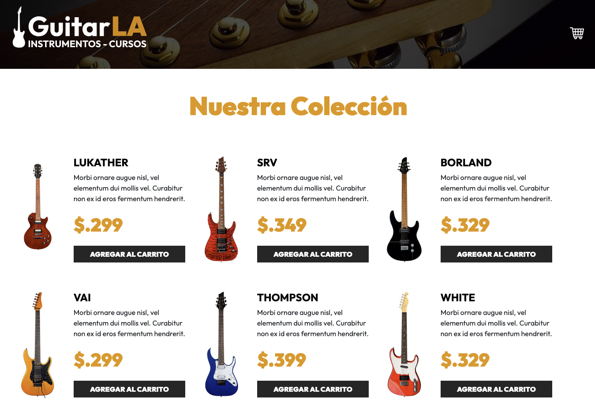

# 🎸 Guitar La

**Guitar La** is a simple e-commerce application built entirely with **React 19** and **Vite**. Developed as part of the course by [Juan de la Torre](https://codigoconjuan.com/), it demonstrates the use of custom React Hooks to manage a product catalog and shopping cart — all without a backend.

---

## 🚀 Tech Stack

- ⚛️ React 19.1
- ⚡ Vite
- 🎨 Plain CSS
- 🧠 React Hooks (`useState`, `useEffect`)

---

## 🛍️ Features

- Browse a list of guitar products
- Add items to the shopping cart
- Increase or decrease item quantities
- Remove individual items or clear the cart
- Fully client-side — no API or database

---

## 📁 Project Structure

```text
src/
├── assets/              # Static assets
├── components/          # Reusable components
│   ├── Footer.jsx
│   ├── Guitar.jsx
│   └── Header.jsx
├── data/
│   └── db.js            # Static product data
├── App.css
├── App.jsx
├── index.css
└── main.jsx
```

---

## 📸 Preview

If you upload a screenshot of the project, save it as `screenshot.png` in the root folder. It will display like this:

```markdown

```

---

## ⚙️ Getting Started

Follow these steps to install and run the project locally on your machine:

### 1. Clone the Repository

> Download the project from GitHub to your computer:

```bash
git clone https://github.com/dvallejos/guitarla.git
```

Then enter the project folder:

```bash
cd guitarla
```

### 2. Install Dependencies

> This will install all the libraries the project needs to work:

```bash
npm install
```

### 3. Start the Development Server

> This will run the app locally and open it in your browser:

```bash
npm run dev
```

Then go to:

```
http://localhost:5173/
```

You will see the Guitar La store running in your browser.

---

## 📦 Build for Production

> If you want to generate a ready-to-deploy version of the app, use:

```bash
npm run build
```

This will create a `dist/` folder with the optimized production files.

---

## 🎓 Based On

This project was created during a course by [Juan de la Torre](https://codigoconjuan.com/), focused on modern React development with custom hooks and real-world examples.

---

